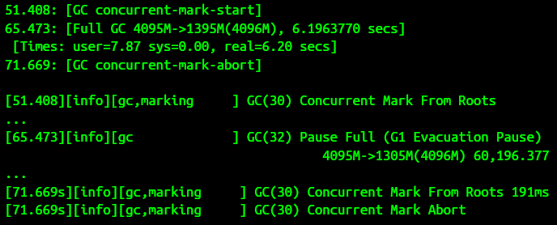

# Garbage Collection

## Garbage Collection Overview

> Garbage Collection is a Mixed Blessing

> Tuning Garbage Collectors is FAR EASIER, and LESS TIME CONSUMING 
> than tracking down ___Pointer Bugs___

> Short of Rewriting Code 
>   - Tuning the garbage collector is the most important thing that can be done 
>     to improve the performance of a Java application

> short of 匱乏

> The performance of Java Apps depends heavily on garbage collection technology

### The performance characteristics of all these collectors are quite different 
- #### We will focus only on those that come with ___OpenJDK___


### How GC Track Objects

#### The JVM must periodically search the heap for unused objects 

#### Starting with objects that are GC Roots 
- GC Roots are objects that are accessible from outside the heap 
    - That primarily includes thread stacks and system classes 
    - Those objects are always reachable
- The GC algorithm scans all objects that are reachable via one of the root objects 
    - Objects that are reachable via a GC root are live objects 
    - the remaining unreachable objects are garbage 
        - even if they maintain references to live objects or to each other


### The Basic Operations of GC
- #### Finding unused objects 
- #### making their memory available
- #### Compacting the heap


### Different collectors take different approaches to these operations


### Both of Java App and GC are Multithreaded 


### Two logical groups of threads
- App Threads: Performing application logic, called mutator threads
    - They are mutating objects as part of the application logic
- GC Threads: Performing GC


### GC must make sure that App Threads are not using those objects
- before tracking object references or move objects around in memory


### NO App Thread can be Accessing the Object
- when GC moves objects around 
    - the memory location of that Object changes during that operation


### Stop The World Pauses
- The pauses when all App Threads are stopped are called ___stop-the-world-pauses___
- These pauses generally have The Greatest Impact on the performance of an app
- Minimizing those pauses is one important consideration when tuning GC


## Generational Garbage Collectors

### Normal Case
- #### Mostly, GCs work by splitting the heap into generations
- #### The Old, or Tenured Genertion 
- #### The Young Generation
    - The Young Generation is further divided into sections known as 
        - The Eden Spaces
        - The Survivor Spaces
- #### The Rationale: many objects are used for a very short period of time
    - A lot of objects are created and discarded quickly in a small amount of code
    - Many (and sometimes most) objects are only used temporarily

> rationale n. /ˌræʃəˈnæl/ rationale (behind/for/of something) the principles 
> or reasons which explain a particular decision, course of action, belief, etc.
> ~ What is the rationale behind these new exams?

### How to Generationalize : a Minor GC or a Young GC
- Objects are first allocated in the young generation, which is a subset of the 
  entire heap
- When the young generation fills up, the GC will stop all the App Threads 
    - and empty out the young generation
- Objects that are no longer in use are discarded 
    - and objects that are still in use are moved elsewhere

#### The Pros
- First, because the young generation is only a portion of the entire heap 
    - processing it is faster than processing the entire heap
    - The App Threads are stopped for a much shorter period of time than if
      the entire heap were processed at once
    - It is almost always a big advantage to have the shorter pauses 
        - even though they will be more frequent
- Second, objects are allocated in eden 
    - which encompasses the vast majority of the young generation 
    - When the young generation is cleared during a collection, all objects in
      eden are either moved or discarded
        - objects that are not in use can be discarded 
        - and objects in use are moved either to 
            - one of the survivor spaces or 
            - the old generation
    - Since all surviving objects are moved
        - the young generation is automatically compacted when it is collected 
    - At the end of the collection, eden and one of the survivor spaces are empty
    - The objects that remain in the young generation are compacted within the 
      other survivor space

#### Common GC algorithms have STOP-THE-WORLD_Pauses 
- during collection of the young generation
- As objects are moved to the old generation, eventually it too will fill up
    - and the JVM will need to find any objects within the old generation that 
      are no longer in use and discard them
    - This is where GC algorithms have their biggest differences

### The Simpler Algorithms : The Full GC

#### Generally causes a relatively Long Pause for the App-Threads
- Stop all application threads 
- Find the unused objects 
- Free their memory
- Compact the heap


### The Concurrent Collectors, Low Pause Collectors, and Pauseless Collectors
- Find unused objects while application threads are running
- An app will typically experience fewer, and much shorter pauses but more CPU 
- More difficult to tune in order to get their best performance


### Considering the Choice

#### Think about the overall performance goals that must be met

#### Trade-Offs exist in every situation

#### For Example: For a REST Server
- The individual requests will be impacted by pause times
    - and more importantly by long pause times for full GCs 
    - If minimizing the effect of pauses on response times is the goal, 
        - a concurrent collector may be more appropriate
    - If the average response time is more important than the outliers 
        - a nonconcurrent collector may yield better results
    - The benefit of avoiding long pause times with a concurrent collector 
      comes at the expense of extra CPU usage
        - If the machine lacks the spare CPU cycles needed by a concurrent collector, 
            - a nonconcurrent collector may be the better choice

#### The choice of garbage collector in a batch App is guided by the following trade-off

- If enough CPU is available 
    - Using the concurrent collector to avoid full GC pauses will allow the job 
      to finish faster
- If CPU is limited
    - The extra CPU consumption of the concurrent collector will cause the 
      batch job to take more time


### GC Algorithms

#### The Serial Garbage Collector : the Simplest One
- This is the default collector if the application is running on 
    - a client-class machine (32-bit JVMs on Windows)
    - a single-processor machine
    - Virtual Machines and Docker Containers with One Core
- Uses a single thread to process the heap
- Stop all App-Threads as the heap is processed
    - for either a minor or full GC
    - During a full GC, it will fully compact the old generation
- Enabled by using the ``` -XX:+UseSerialGC ``` flag
    - the serial collector is not disabled by changing the ``` + ``` sign to 
      a ``` - ``` sign: ``` -XX:-UseSerialGC ```
    - On systems where the serial collector is the default, it is disabled by 
      specifying a different GC algorithm

#### The Throughput Collector (Being often Called the Parallel Collector)
- The default in most situations where it would be used (JDK 8)
    - Needn't be explicitly enabled
    - To enable it where necessary, use the flag ``` -XX:+UseParallelGC ```
- Uses multiple threads to collect the young generation
- Uses multiple threads to process the old generation as well
- Stops all App Threads during both minor and full GCs 
    - and it fully compacts the old generation during a full GC

#### The G1 GC Collector
- Uses a concurrent collection strategy to collect the heap with minimal pauses
- The default collector in JDK 11 and later for 64-bit JVMs on machines with 
  two or more CPUs
- Divides the heap into Regions but still considers the heap to have two 
  generations
    - Some of those regions make up the young generation
- The young generation is still collected by Stopping ALL App Threads
    - and moving all objects that are alive into the old generation 
        - or the survivor spaces
- The old generation is processed by background threads that don’t need to
  stop the application threads to perform most of their work
    - Clean up objects from the old generation by copying from one region into 
      another
    - Compacts the heap during normal processing
    - Helps keep G1 GC heaps from becoming fragmented, although that is still 
      possible
- The trade-off for avoiding the full GC cycles is CPU time
    - the (multiple) background threads G1 GC uses to process the old generation 
      must have CPU cycles available at the same time the App Threads are running
- G1 GC is enabled by specifying the flag ``` -XX:+UseG1GC ``` 
    - In most cases, it is the default in JDK 11

#### The CMS Collector
- Stops all application threads during a minor GC
    - which it performs with multiple threads
    - officially deprecated in JDK 11 and beyond

#### Experimental Collectors

### Causing and Disabling Explicit Garbage Collection

#### GC is typically caused when the JVM decides GC is Necessary
- A minor GC will be triggered when the new generation is full
- a full GC will be triggered when the old generation is full
- a concurrent GC (if applicable) will be triggered when the heap starts to 
  fill up

#### Calling ``` System.gc() ``` method is almost always a bad idea
- This call always triggers a full GC 
    - even if the JVM is running with G1 GC or CMS
    - so App Threads will be stopped for a relatively long period of time
    - not make the app any more efficient
    - cause a GC to occur sooner than might have happened otherwise
- For small benchmarks that run a bunch of code to properly warm up the JVM 
    - forcing a GC before the measurement cycle may make sense
- When doing heap analysis, it is usually a good idea to force a full GC before 
  taking the heap dump

#### ``` jcmd <process id> GC.run ```

#### GCs can be prevented by including ``` -XX:+DisableExplicitGC ```in the JVM arguments

#### Quick Summary of GC Algorithms
- The supported GC algorithms take different approaches toward minimizing the 
  effect of GC on an application 
- The serial collector makes sense (and is the default) when only one CPU is 
  available and extra GC threads would interfere with the app
- The throughput collector maximizes the total throughput of an app but may 
  subject individual operations to long pauses 
- G1 GC is the default in JDK 11 and beyond 
    - it concurrently collects the old generation while app threads are running,
    - potentially avoiding full GCs 
    - Its design makes it less elikely to experience full GCs than CMS 


### Choosing a GC Algorithm
- The choice of a GC algorithm depends in part on 
    - the hardware available 
    - what the application looks like 
    - the performance goals for the application
- In JDK 11, ``` G1 GC ``` is often the better choice

#### When to use (and not use) the Serial Collector, including 
- virtual machines with one CPU
- and Docker containers that are limited to  one CPU
> On a machine with a single CPU, the JVM defaults to using the serial collector

> But at times (sometimes) ``` G1 GC ``` will give better results

> An App with a very small heap (say, 100 MB) may still perform better 
> with the ``` serial collector ``` regardless of the number of cores that are 
> available

#### When to use (and not use) the ``` Throughput Collector ```

    
### Average CPU Usage and GC


### Summary of Garbage Collection Overview
- ``` G1 GC ``` is currently the better algorithm to choose for a majority of apps
- The ``` serial ``` collector makes sense when running CPU-bound apps on a machine 
    - with a single CPU, even if that single CPU is hyper-threaded 
    - ``` G1 GC ``` will still be better on such hardware for jobs that aren't CPU-bound
- The ``` throughput ``` collector makes sense on multi-CPU machines running jobs 
    - that are CPU-bound 
    - Even for jobs that are not CPU bound, the ``` throughput ``` collector 
      can be the better choice 
        - if it does relatively few full GCs 
        - or if the old generation is generally full


## Basic GC Tuning

> GC algorithms share basic configuration parameters

### Sizing the Heap

#### If the heap is too small 
- The program will spend too much time performing GC and not enough time 
  performing application logic 

#### A very large heap isn’t necessary 
- The time spent in ___GC Pauses___ is dependent on the size of the heap
- The size of the heap increases, the Duration of those ___GC Pauses___ also increases 
    - The Pauses will occur less frequently, but their duration will make the 
      overall performance lag

> lag v. /læɡ/ lag (behind somebody/something) | lag (behind) 
> - To move or develop slowly or more slowly than other people, organizations, etc
> - The little boy lagged behind his parents.
> - We still lag far behind many of our competitors in using modern technology 

#### A second danger arises when very large heaps are used
- The Virtual Memory Management of OS

> The first rule in sizing a heap is never to specify a heap that is larger 
> than the amount of Physical Memory on the machine
> - and if multiple JVMs are running, that applies to the sum of all their heaps

> Also leave some room for the native memory of the JVMJ, 
> - as well as some memory for other Apps

> Also leave, typically, at least 1 GB of space for common OS profiles

#### The size of the heap is controlled by two values
- an initial value, specified with ```-XmsN ```
- a maximum value, specified with ``` -XmxN ```
- The defaults vary depending on 
    - the operating system,
    - the amount of system RAM
    - and the JVM in use
    - Can be affected by other flags on the command line as well

> Heap sizing is one of the JVM’s core ergonomic tunings

> ergonomic /ˌɜːrɡəˈnɑːmɪk/ 
> - designed to make people’s working environment more comfortable and to help them work more efficiently
> - ergonomic design / an ergonomic keyboard/chair

#### The goal of the JVM is to find a REASONABLE Default Initial Value 
- for the heap based on the system resources available to it
- Other goal is to grow the heap up to a REASONABLE MAXIMUM 
    - if (and only if) the App needs more memory 
      - based on how much time it spends performing GC

#### The default values for the initial and maximum sizes
| Operating System and JVM   | Initial heap (Xms)                    | Maximum heap (Xmx)                  |
|----------------------------|:--------------------------------------|:------------------------------------|
| Linux                      | Min (512 MB, 1/64 of physical memory) | Min (32 GB, 1/4 of physical memory) |
| macOS                      | 64 MB                                 | Min (1 GB, 1/4 of physical memory)  |
| Windows 32-bit client JVMs | 16 MB                                 | 256 MB                              |
| Windows 64-bit server JVMs | 64 MB                                 | Min (1 GB, 1/4 of physical memory)  |

#### For Docker Containers
- For JDK 11, the JVM will use the memory limit of the container

#### Having an initial and maximum size for the heap allows the JVM to tune 
- its behavior depending on the workload
    - If the JVM sees that it is doing too much GC with the initial heap size
        - it will continually increase the heap until 
            - the JVM is doing the CORRECT amount of GC 
        - or until the heap hits its maximum size

#### For Apps that don’t need a large heap, that means 
- a heap size doesn't need to be set at all

#### Usually need to specify a maximum heap
- in a world where JVMs run in isolated containers  
- On a virtual machine running primarily a single JVM 
    - the default initial heap will be only 1/4 of the memory assigned to 
      the virtual machine
- In a JDK 11 Docker container with a memory limit 
    - Make the heap to consume most of that memory
    - Leaving headroom (餘量) as mentioned earlier

#### A Good Rule Of Thumb is to size the heap so that it is ``` 30% ```occupied after a FULL GC
- To calculate this, run the app until it has reached a steady-state configuration 
    - A point at which 
        - It has loaded anything it caches
        - It has created a maximum number of client connections, and so on
- Then connect to the application with jconsole
    - Force a full GC
    - Observe how much memory is used when the full GC completes
- make sure to size your container (if applicable) to have an additional 
  ``` 0.5–1 GB ``` of memory for nonheap needs of the JVM

#### If knowing exactly what size heap the App needs
- Set both the initial and maximum values of the heap to that value 
  e.g., ``` -Xms4096m -Xmx4096m ```
    - This makes GC slightly more efficient 
        - because it never needs to figure out whether the heap should be resized


### Sizing the Generations
> Once the heap size has been determined, the JVM must decide 
> - how much of the heap to allocate to the young generation 
> - how much to allocate to the old generation

#### A relatively larger Young Generation 
- Young GC Pause Times will increase 
- but the Young Generation will be collected less often 
    - and fewer objects will be promoted into the old generation 
- The Old Generation is relatively smaller, it will fill up more frequently 
    - and do more full GCs

> Striking a Balance Is Key 取得平衡是關鍵

#### All GC Algorithms use the same set of flags to set the sizes of the generations

#### The command Line Flags to tune the generation sizes 
- all adjust the size of the young generation 
- the old generation gets everything that is left over 

#### A variety of flags can be used to size the young generation

- ``` -XX:NewRatio=N ``` Set the ratio of the young generation to the old generation 
    - Default value is 2
    - Formula: ``` Initial Young Gen Size = Initial Heap Size / (1 + NewRatio) ```
    - By default, the Young Generation starts out at 33% of the initial heap size
    - The Young Generation is first sized by the NewRatio
    - If an App needs a dynamically sized heap and requires a larger (or smaller) 
      young generation, then FOCUS on setting the ``` NewRatio ``` value

- ``` -XX:NewSize=N ``` Set the initial size of the young generation 
    - the size of the Young Generation can be set explicitly by specifying the
      ``` NewSize ``` flag 
    - Takes precedence over the value calculated from the ``` NewRatio ```
> precedence noun /ˈpresɪdəns/ precedence (over somebody/something) 
> - the condition of being more important than somebody else and therefore 
>   coming or being dealt with first === priority
> - She had to learn that her wishes did not take precedence over other people's needs 
> - The speakers came on to the platform in order of precedence (= the most important one first) 
> - Environmental concerns must be given precedence over commercial interest 

- ``` -XX:MaxNewSize=N ``` Set the maximum size of the young generation 
    - As the heap expands, the Young Generation Size will expand as well 
    - up to the maximum size specified by the ``` MaxNewSize ``` flag
    - By default, that maximum is also set using the ``` NewRatio ```value 
    - though it is based on the maximum (rather than initial) heap size
    - Tuning the young generation by specifying a range for its minimum and 
      maximum sizes ends up being fairly difficult
    
- ``` -XmnN ``` Shorthand for setting both NewSize and MaxNewSize to the same value 
    - When a heap size is fixed (by setting -Xms equal to ``` -Xmx ```) 
        - it is usually preferable to use ``` ``-Xmn ``` to specify a fixed 
          size for the Young Generation as well

#### Adaptive (自適應) Sizing
- The Best-Effort Solution (盡力而為的)
    - The sizes of the Heap, the Generations, and the Survivor Spaces 
        - can vary during execution as the JVM attempts to find the optimal 
          performance according to its policies and tunings
- Many Apps don’t really need to worry about tuning their heap size at all
    - The JVM can AUTOTUNE the Heap and Generation Sizes to 
        - use an Optimal Amount of Memory 
        - given the GC algorithm's performance goals 
    - Adaptive sizing is what allows that AUTOTUNING to work
- Adaptive Sizing can be disabled by setting ``` -XX:-UseAdaptiveSizePolicy ``` flag
- Adaptive Sizing is set to true by default ``` -XX:+UseAdaptiveSizePolicy ```
- Adaptive Sizing is also effectively Turned Off 
    - if the minimum and maximum heap sizes are set to the same value
    - the initial and maximum sizes of the new generation are set to the same value
- To see how the JVM is resizing the spaces in an application 
    - set the ``` -XX:+PrintAdaptiveSizePolicy ``` flag

#### The Summary of Sizing the Generations
- Within the overall heap size, the sizes of the generations are controlled by 
    - how much space is allocated to the young generation
- The young generation will grow in tandem with the overall heap size 
    - but it can also fluctuate as a percentage of the total heap 
        - based on the initial and maximum size of the young generation
- Adaptive sizing controls how the JVM alters the ratio of young generation to 
  old generation within the heap
- Adaptive sizing should generally be kept enabled 
    - since adjusting those generation sizes is how GC algorithms attempt to 
      meet their pause-time goals
- For finely tuned heaps, adaptive sizing can be disabled for a SMALL 
  Performance Boost

> tandem noun /ˈtændəm/ a bicycle for two riders, one behind the other
> in tandem (with somebody/something): if somebody/something works or happens 
> in tandem with somebody/something else, they work together or happen at the 
> same time
> - The two systems are designed to work in tandem 
> - Two designers worked in tandem on the plans
> - Stock prices pushed sharply higher this afternoon in tandem with a rise in the dollar

> fluctuate verb /ˈflʌktʃueɪt/ to change frequently in size, amount, quality, 
> etc., especially from one extreme to another
> - fluctuating prices
> - fluctuate between A and B: During the crisis, oil prices fluctuated between 
>   $20 and $40 a barrel


### Sizing Metaspace

#### A separate heap space is used to keep track of certain metadata about classes 
- that the JVM is loading
- Also called ``` permgen ```

#### Information in the Metaspace is used only by the Compiler and JVM Runtime 
- and the data it holds is referred to as class metadata

#### Tuning the ``` metaspace ```  is fairly rare these days
- The default values for the size of the ``` metaspace ``` are very generous
> generous adj. /ˈdʒenərəs/ more than is necessary; large
> - The car has a generous amount of space
> - The review panel criticized the payments as overly generous

| JVM               | Default Initial Size | Default Maximum Size |
|-------------------|----------------------|----------------------|
| 32-bit client JVM | 12 MB                | Unlimited            |
| 32-bit server JVM | 16 MB                | Unlimited            |
| 64-bit JVM        | 20.75 MB             | Unlimited            |

#### Initial Sizing
- ``` -XX:MetaspaceSize=N ```

#### Maximum Sizing
- ``` -XX:MaxMetaspaceSize=N ```

#### If seting the maximum size too small
- The App will eventually get an ``` OutOfMemoryError ``` when the metaspace fills up
- Needs to figure out why the class metadata is too large

#### Resizing the metaspace is an expensive operation
- as it requires a full GC  

#### Increasing the initial size is a good idea to improve startup when 
- there are a lot of full GCs during the startup of a program, as it is loading classes
- Servers, for example, typically specify an initial metaspace size of 
- ``` 128 MB ```, ``` 192 MB ```, or more

#### Java Classe Loaders can ALSO be eligible for GC 
- For an App Server, creates new classloaders every time an app's deployed, or redeployed
- The old classloaders are then unreferenced and eligible for GC
- Meanwhile, the new classes of the app will have new metadata 
    - and so there must be room in the metaspace for that
- This often causes a full GC because the metaspace needs to grow, or discard old metadata

#### One reason to limit the size of the metaspace 
- is to guard against a classloader leak
- ``` jmap ``` can be used with the argument ``` -clstats ``` to print out 
  information about the classloaders

#### Summary of Sizing Metaspace
- The metaspace holds class metadata (not class objects) and behaves like a separate heap 
- The initial size of this region can be based on its usage after all classes have been loaded
    - That will slightly speed up startup 
- Apps that define and discard a lot of classes will see an occasional full GC 
    - when the metaspace fills up and old classes are removed
        - This is particularly common for a development environment 


### Controlling Parallelism

#### All GC Algorithms except the Serial Collector use Multiple Threads
- The number of these threads is controlled by the ``` -XX:ParallelGCThreads=N ``` flag

#### The value of ``` -XX:ParallelGCThreads=N ``` flag affects the number of threads 
- used for the following operations:
    - Collection of the Young Generation when using ``` -XX:+UseParallelGC ```
    - Collection of the old generation when using ``` -XX:+UseParallelGC ```
    - Collection of the Young Generation when using ``` -XX:+UseG1GC ```
    - Stop-the-world phases of G1 GC (though not full GCs)
- Because the GC Operations above stop all App Threads from executing 
    - the JVM attempts to use as many CPU resources as it can in order to 
        - minimize the pause time
    - Means the JVM will run one thread for each CPU on a machine, up to 8
        - Once that threshold has been reached, the JVM adds a new thread for 
          only every 1.6 CPUs
    - So the total number of threads (where N is the number of CPUs) on a 
      machine with more than eight CPUs is: 
        - ``` ParallelGCThreads = 8 + ((N - 8) * 5 / 8) ```

#### Summary of Controlling Parallelism
- The basic number of threads used by all GC algorithms is based on 
    - the number of CPUs on a machine
- When multiple JVMs are run on a single machine, that number will be too high 
  and must be reduced


## GC Tools

### The best way to see the effect that GC has on the performance of an App
- is to become familiar with the GC Log
- GC Log is a record of every GC operation during the program's execution


### The details in the GC log VARY depending on the GC Algorithm
- the basic management of the log is the same for all algorithms


### Enabling GC Logging in JDK 11

#### All Logging, GC related or Not, is Enabled via the Flag ``` -Xlog ```
- Then appending various options to that flag that control how the logging 
  should be performed
- Example: 
    - ``` -Xlog:gc*:file=C:\temp\gc.log:time:filecount=7,filesize=8M ```
    - for Windows: ``` -Xlog:gc*:file=\"C:\temp\gc.log\":time:filecount=7,filesize=8M ```
    - The colons divide the command into four sections
    - run java ``` -Xlog:help: ``` to get more information on the available options
- The first section ``` gc* ``` specifies which modules should enable logging 
    - ``` gc* ```, enables all GC modules
    - ```gc+age ``` will log information about the tenuring of an object
    - ``` gc*,gc+age=debug ``` log basic (infolevel) messages from all gc 
      modules and debug-level messages from the tenuring code
    - Typically, Logging All Modules at Info Level is fine
- The second section ``` file=gc.log ``` sets the destination of the logfile
- The third section ``` time ``` is a decorator 
    - that decorator says to log messages with a time-of-day stamp 
    - Multiple decorators can be specified
- The fourth section specifies output options
    - to rotate logs when they hit 8 MB
    - keeping eight log files altogether

#### The logs will be written this way
- Start logging to gc.log 
- When that is full, rename it to gc.log.0 and start a new gc.log 
- When that is full, rename it to gc.log.1 and start a new gc.log 
- When that is full, rename it to gc.log.2 and start a new gc.log 
- When that is full, rename it to gc.log.0, removing the old gc.log.0, 
  and start a new gc.log

#### Parsing the logs for aggregate information about the App 
- how many pauses it had 
- how long they took on average and in total
- etc.

#### Use ``` jClarity (Censum) ```, or ``` GCeasy ``` to parse log files

#### For real-time monitoring of the heap, use ``` jvisualvm ``` or ``` jconsole ```

#### For a scriptable solution, ``` jstat ``` is the tool of choice
- Live GC Analysis
    - ``` jstat ``` provides nine options to print different information about the heap
    - ``` jstat -options ``` will provide the full list
    ``` 
    jstat -options
        -class
        -compiler
        -gc
        -gccapacity
        -gccause
        -gcmetacapacity
        -gcnew
        -gcnewcapacity
        -gcold
        -gcoldcapacity
        -gcutil
        -printcompilation
    λ jstat -class 30236
    Loaded      Bytes         Unloaded      Bytes     Time
      2091     4211.6                0        0.0     0.17
    ```
- One useful option is ```-gcutil```, which displays the time spent in GC, 
    - as well as the percentage of each GC area that is currently filled
    - Other options to ``` jstat ``` will display the GC sizes in terms of KB
- ``` jstat ``` takes an optional argument 
    - the number of milliseconds to repeat the command 
        - so it can monitor over time the effect of GC in an App
- Use ``` jps ``` to quickly find out Java App's Process ID
- ``` jstat -gcutil 23461 1000 7 ```
    - Process ID: 23461
    - Set 1000 milliseconds to repeat the command
    - This example attaches to lvmid 23461 and takes 7 samples at 1000 millisecond 
      intervals 
    - Summary of garbage collection statistics
        - S0: Survivor space 0 utilization as a percentage of the space's current capacity 
        - S1: Survivor space 1 utilization as a percentage of the space's current capacity 
        - E: Eden space utilization as a percentage of the space's current capacity 
        - O: Old space utilization as a percentage of the space's current capacity 
        - M: Metaspace utilization as a percentage of the space's current capacity 
        - CCS: Compressed class space utilization as a percentage 
        - YGC: Number of young generation GC events 
        - YGCT: Young generation garbage collection time 
        - FGC: Number of full GC events 
        - FGCT: Full garbage collection time 
        - CGC: Number of concurrent GC events
        - CGCT: Concurrent garbage collection time
        - GCT: Total garbage collection time
    - [-gcutil option](https://docs.oracle.com/en/java/javase/17/docs/specs/man/jstat.html#the-gcutil-option)
    - [CGC, CGCT, GCT](https://www.coder.work/article/1822732)
    - [JVM Options](https://www.oracle.com/java/technologies/javase/vmoptions-jsp.html)

| S0    | S1    | E     | O     | M   | CCS  | YGC       | YGCT  | FGC  | FGCT  | CGC  | CGCT     | GCT    |
|-------|-------|-------|-------|-----|------|-----------|-------|------|-------|------|----------|--------|
| 51.71 | 0.00  | 99.12 | 60.00 | -   | -    | 0         | 0.000 | 0    | 0.000 | 0    | 0.000    | 0.000  |

### Summary of GC Tools
- GC logs are the key piece of data required to diagnose GC issues 
    - they should be collected routinely (even on production servers) 
- A better GC logfile is obtained with the ``` PrintGCDetails ``` flag 
- Programs to parse and understand GC logs are readily available 
    - they are helpful in summarizing the data in the GC log
- jstat can provide good visibility into GC for a live program 


## Summary of GC Instroduction

### For many Apps, Selecting the appropriate GC Algorithm is the only tuning requirement 
- and if needed, to increase the heap size of the App


### Adaptive Sizing will then allow the JVM to autotune its behavior 
- to provide good performance using the given heap 


### More-complex Apps will require additional tuning, particularly for specific GC Algorithms
- If the simple GC settings do not provide the performance an app requires 
    - consult the tunings


## Garbage Collection Algorithms 

### Overview

#### The Key Information needed to tune an individual Collector 
- the data from the GC log when that collector is enabled
- looking at each algorithm from the perspective of the GC log files 
    - which allowing to understand 
        - how the GC algorithm works 
        - how it can be adjusted to work better


### Understanding the Throughput Collector

#### Garbage Collectors must do three basic operations
- Find Unused Objects 
- Free Their Memory 
- Compact The Heap

#### The Throughput Collector does all of those operations in the same GC Cycle 
- Together those operations are referred to as a collection
- These collectors can collect either the young generation or the old generation 
  during a single operation

#### The heap before and after a young collection


- A Young Collection occurs when Eden has filled up
- The young collection moves all objects out of Eden
    - Some are moved to one of the Survivor Spaces (S0)
    - Some are moved to the Old Generation, which now contains more objects
    - Many objects are discarded because they are no longer referenced


- This GC occurred ``` 17.806 ``` seconds after the program began
- Objects in the young generation now occupy 14,463 KB
    - ``` 14 MB ```, in the survivor space (S0)
    - before the GC, they occupied ``` 227,983 KB (227 MB) ```
- The total size of the young generation at this point is ``` 264 MB ```
- Meanwhile, the overall occupancy of the heap (both Young and Old Generations)
  decreased from ``` 280 MB ``` to ``` 66 MB ```
    - and the size of the entire heap at this point was ``` 613 MB ```
- The operation took less than ``` 0.02 ``` seconds (0.0169320 seconds)
- The program was charged for more CPU time than real time 
     - because the Young Collection was done by multiple threads 
       in this configuration, four threads


- the metaspace sizes will never change during a young collection
- The metaspace is also not included in the total heap size reported on the 
  fifth line of this sample

#### The heap before and after a Full GC

- The old collection frees everything out of the young generation
- The survivor spaces have been cleared as well
- The only objects that remain in the old generation are those 
    - that have active references 
    - and all of those objects have been compacted so that the beginning of the 
      old generation is occupied


- The data in the young generation decreased from ``` 16 MB ``` to ``` 0 MB ```
- The young generation now occupies ``` 0 bytes ```, and its size is ``` 339 MB ```
- The survivor spaces have been cleared as well
- The data in the old generation decreased from ``` 457 MB ``` to ``` 392 MB ```
- The entire heap usage has decreased from ``` 473 MB ``` to ``` 392 MB ```
    - 457 + 16 = 473
- It has taken ``` 1.3 seconds ``` of real time
    - and ``` 4.4 seconds ``` of CPU time (again for four parallel threads)

#### Summary of the Throughput Collector
- The throughput collector has two operations 
    - Minor Collections
    - Full GCs 
- Each of which marks, frees, and compacts the target generation 
- Timings taken from the GC log are a quick way to determine the overall impact 
  of GC on an App using these collectors


### Adaptive and Static Heap Size Tuning

#### Adaptive Sizing in the Throughput Collector will Resize 
- the heap 
- and the generations
- in order to meet its pause-time goals

#### Adaptive Resizing Goals
- ``` -XX:MaxGCPauseMillis=N ``` 
    - Specifies the maximum pause time that the App is willing to tolerate
    - By default, this flag is not set
    - Might be tempting to set this to 0, or perhaps a small value like ``` 50 ms ```
    - This goal applies to both minor and full GCs
    - If a very small value is used, the App will end up with a very small 
      Old Generation
    - Causes the JVM to perform very, very frequent Full GCs
        - Performance will be dismal (not successful; of very low quality)
- ``` -XX:GCTimeRatio=N ```
    - Specifies the amount of time you are willing for the App to spend in GC
        - Compared to the amount of time its application-level threads should run
    - It is a ratio, so the value for N takes a little thought
      ``` 
      ThroughputGoal = 1 − [(1 / (1 + GCTimeRatio )]
      ```
    - The default value for GCTimeRatio is 99
        - Meaning that the goal is to spend 99% of time in app-processing 
        - and only 1% of time in GC
    - ``` 
      GCTimeRatio = Throughput / (1 − Throughput)
      ```
- The JVM uses these two flags to set the size of the heap 
    - within the boundaries established by the 
        - initial (-Xms) 
        - maximum (-Xmx) 
- ``` -XX:MaxGCPauseMillis=N ``` flag takes precedence
    - If it is set, the sizes of the young and old generations are adjusted 
      until the pause-time goal is met
    - Once that happens, the overall size of the heap is increased until the
      ``` -XX:GCTimeRatio=N ``` goal is met
    - Once both goals are met, the JVM will attempt to reduce the size of the 
      heap so that it ends up with the smallest possible heap that meets these 
      two goals
    - Because the ``` -XX:MaxGCPauseMillis=N ``` goal is not set by default 
        - the usual effect of automatic heap sizing is that the heap 
          (and generation) sizes will increase until the ``` -XX:GCTimeRatio=N ``` 
          goal is met
        - the default setting of ``` -XX:GCTimeRatio=N ``` flag is optimistic
- The best setting will vary depending on the application goals
- ``` 5% ``` of time in GC is a good one
- ``` MORE ``` isn’t always better

#### Summary of Adaptive and Static Heap Size Tuning
- Dynamic heap tuning is a good first step for heap sizing
    - For a wide set of apps, that will be all that is needed 
        - and the dynamic settings will minimize the JVM’s memory use
- It is possible to statically size the heap to get the maximum possible performance 
    - The sizes the JVM determines for a reasonable set of performance goals 
      are a good first start for that tuning


### Understanding the G1 Garbage Collector - Garbage First

#### Overview
- G1 GC operates on discrete regions within the heap 
- Each region (there are by default around 2048) can belong to either 
    - the old 
    - or new generation 
- and the generational regions need not be contiguous 
- The idea behind having regions in the old generation is that 
    - when the concurrent background threads look for unreferenced objects, 
      some regions will contain more garbage than other regions
    - The actual collection of a region still requires that App Threads 
      be stopped, but G1 GC can focus on the regions that are mostly garbage and 
      spend only a little of time emptying those regions
- This G1 Garbage Collector clearing out only the mostly garbage regions 
    - is what gives G1 GC its name: garbage first
- Doesn't apply to the regions in the young generation
    - During a young GC, the entire young generation is either 
        - freed (free v.)
        - or promoted to a survivor space or to the old generation 
    - However, Still, the young generation is defined in terms of regions, 
    - in part because it makes resizing the generations much easier if the 
      regions are predefined

#### G1 GC is called a Concurrent Collector 
- because the marking of free objects within the old generation happens 
  concurrently with the App-Threads
- But it is not completely concurrent because 
    - the marking and compacting of the young generation requires stopping 
      all App Threads
    - the compacting of the old generation also occurs while the App Threads 
      are stopped

#### G1 GC has four Logical Operations
- A Young Collection
- A background, Concurrent Marking Cycle
- A Mixed Collection
- If necessary, a Full GC

#### The G1 GC Young Collection 

- Each small square in this figure represents a G1 GC region
- The data in each region is represented by the black area
    - and the letter in each region identifies the generation to which the 
      region belongs
        - [E]den generation 
        - [O]ld generation 
        - [S]urvivor space
- Empty-Regions do not belong to a generation 
    - G1 GC uses them arbitrarily for whichever generation it deems necessary
- The G1 GC Young Collection is triggered when Eden Fills Up
    - In this case, after filling four regions
- After the Collection, Eden is empty 
    - Although regions are assigned to it, which will begin to fill up with 
      data as the application proceeds
    - At least one region is assigned to the survivor space 
        - partially filled in this example 
        - and some data has moved into the old generation

#### The GC log of G1 GC


#### Concurrent Marking Cycle Performed by G1 GC


- The Young Generation has changed its occupancy
    - There will be at least one (and possibly more) Young Collections during 
      the concurrent cycle
    - The eden regions before the marking cycle have been completely freed
        - and new eden regions have started to be allocated
- Some regions are now marked with an X
    - Those regions belong to the Old Generation 
        - and they still contain data 
        - they are regions that the marking cycle has determined contain mostly 
          GARBAGE
- The old generation (consisting of the regions marked with an O or an X) is 
  actually more occupied after the cycle has completed
    - That's because the Young Generation Collections that occurred during the 
      Marking Cycle promoted data into the old generation
- The marking cycle doesn't actually free any data in the old generation
    - It merely identifies regions that are mostly garbage
    - Data from those regions is freed in a later cycle

#### The G1 GC Concurrent Marking Cycle has several Phases
- Some of those Phases stop all app-threads 
    - and some of those Phases do not
- The First Phase: Concurrent Start Phase
  
    - JDK 8:  initial-mark phase
    - [JDK 17](https://docs.oracle.com/en/java/javase/17/gctuning/garbage-first-g1-garbage-collector1.html#GUID-F1BE86FA-3EDC-4D4F-BDB4-4B044AD83180)
    - This phase stops all App-Threads
        - partly because it also executes a Young Collection 
            - and it sets up the next phases of the cycle
    - G1 GC takes advantage of the young GC cycle to do the initial mark work
        - Since the initial mark of the marking cycle phase also requires all 
          App Threads to be stopped
- Next Phase, G1 GC Scans the Root Region

    - takes 0.58 seconds
    - Doesn't stop the App Threads, uses only the background threads
    - This phase cannot be interrupted by a Young Collection
      
        - The GC pause here starts before the end of the root region scanning
        - In JDK 11, the timestamp of the end of the root region scanning is 
          exactly the same at which the next Young Collection begins
- The G1 GC Concurrent Marking Phase
    - Happens completely in the background
    - a message is printed when it starts and ends
      
    - Concurrent marking can be interrupted, so Young Collections may occur 
      during this phase
- The Remarking Phase
    - These phases stop the App Threads, though usually for a short time
      
- The Normal Additional Cleanup Phase happens concurrently
  
- And with that, the normal G1 GC background marking cycle is complete
    - insofar as finding the garbage goes at least
> insofar as : 在 ... 情況下.
- But very LITTLE has actually been freed yet 
- A little memory was reclaimed in the cleanup phase 
    - but all G1 GC has really done at this point is to identify old regions 
      that are mostly garbage and can be reclaimed 
      (the ones marked with an X in Figure 6-5)

####　G1 GC executes a Series of Mixed GCs
- They perform the normal Young Collection 
    - but also collect some of marked regions from the background scan
  
- The Log of Mixed GCx
  
    - The mixed GCs clean up enough memory to prevent future concurrent failures
    - In JDK 11, the first mixed GC is labeled "Prepared Mixed" and immediately 
      follows the concurrent cleanup
    - The Mixed GC cycles will continue until (almost) all the marked regions 
      have been collected 
        - at which point G1 GC will resume regular young GC Cycles
        - Eventually, G1 GC will start another concurrent cycle to determine 
          which regions in the old generation should be freed next
    - The young collections are sometimes labeled normally following a 
      concurrent cycle (i.e., G1 Evacuation Pause) 
    - If the concurrent cycle found regions in the old generation that can be 
      completely freed
        - those regions are reclaimed during the regular young evacuation pause 
    - Objects are being freed from the young generation or promoted into the 
      old generation 
        - and at the same time garbage objects (regions, really) are being freed 
          from the old generation
    - If all goes well, that's the entire set of GC activities in the GC log

####　Failure Cases in Mixed GCs
- If observing ___a Full GC___ in the Log, this meas that More Tuning, including, 
    - possibly, More Heap Space, will benefit the App's Performance
    - This Failure Cases is triggered primarily Four Times
        - ___Concurrent Mode Failure___ 
            - G1 GC starts a Marking Cycle, but the old generation fills up 
              before the cycle is completed
            - In that case, G1 GC aborts the Marking Cycle
              
            - This Failure means that 
                - heap size should be increased 
                - the G1 GC background processing must begin sooner 
                - or the cycle must be tuned to run more quickly
                  (e.g., by using additional background threads)
        - ___Promotion Failure___
            - G1 GC has completed a marking cycle 
            - G1 GC has started performing mixed GCs to clean up the old regions 
            - Before it can clean enough space, too many objects are promoted 
              from the young generation 
            - and so the Old Generation still Runs Out Of Space
            
            - This failure means : 
                - the Mixed Collections need to Happen More Quickly 
                - Each Young Collection needs to Process More Regions in the 
                  Old Generation
            - When performing a Young Collection, there isn't enough room in 
              the Survivor Spaces and the Old Generation to hold all the 
              surviving objects 
            - This appears in the GC logs as a specific kind of young GC
             
            - This is an indication that the heap is largely full or fragmented
            - G1 GC will attempt to compensate
            - This can end badly: the JVM will resort to performing a full GC 
            - The easy way to overcome this is to increase the heap size 
                - though possible solutions are given in "Advanced Tunings" part 
            - > compensate verb /ˈkɑːmpenseɪt/ compensate (for something) 
              > to provide something good to balance or reduce the bad effects 
              > of damage, loss, etc.
        - Humongous Allocation Failure
            - Applications that allocate very Large Objects can trigger another 
              kind of full GC in G1 GC 
                - see "G1 GC allocation of Humongous Objects" for more details
                  
        - Metadata GC Threshold
            - The Metaspace is essentially a separate heap and is collected 
              independently of the main heap
            - It is not collected via G1 GC 
            - G1 GC will perform a full GC on the main heap
                - immediately preceded by a Young Collection 
            

#### Quick Summary of Understanding the G1 Garbage Collector
- G1 has multiple cycles (and phases within the concurrent cycle)
- A Well-Tuned JVM running G1 should experience only 
    - Young GC Cycle
    - Mixed GC Cycle
    - Concurrent GC Cycle 
- Small Pauses occur for some the G1 Concurrent Phases 
- G1 should be tuned if necessary to Avoid Full GC Cycles 


### Tuning G1 GC

> One of the goals of G1 GC is that it Shouldn't have to be Tuned that much

#### The Major Goal in tuning G1 GC 
- Make sure that no Concurrent Mode or Evacuation Failures end up requiring a 
  ___Full GC___
- The techniques used to prevent a full GC can also be used when frequent 
  Young GCs must wait for a root region scan to complete
- In JDK 11, the Full GC is executed by Multiple Threads 
    - leading to a shorter pause time

#### The Options to Prevent a Full GC
- Increase the size of the old generation either by 
    - Increasing the heap space overall 
    - or by Adjusting the ratio between the generations
- Increase the number of Background Threads (assuming there is sufficient CPU)
- Perform G1 GC background activities more frequently
- Increase the amount of work done in mixed GC cycles

#### G1 GC is primarily Tuned via a Single Flag
- ``` -XX:MaxGCPauseMillis=N ```
    - The same flag that was used to tune the throughput collector
- With G1 GC, it has a default value ``` 200 ms ```
- If Pauses for any Stop-the-World Phase of G1 GC start to exceed that value, 
  G1 GC will attempt to Compensate 
    - Adjusting the Young-to-Old Ratio 
    - Adjusting the heap size 
    - Starting the background processing sooner
    - Changing the Tenuring Threshold 
    - and (most significantly) Processing more or fewer old generation regions 
      during a Mixed GC Cycle
- Some Trade-Offs Applied Here
    - If the flag's value is reduced, the young size will contract to meet the 
      Pause-Time goal, but More FREQUENT Young GCs will be performed
    - In addition, the number of Old Generation Regions that can be collected 
      during a mixed GC will decrease to meet the Pause-Time Goal 
        - which INCREASES the Chance of Concurrent Mode Failure
- If Setting a Pause-Time Goal DOES NOT prevent the Full GCs from Happening 
    - The various aspects can be tuned individually
    - Tuning the Heap Sizes for G1 GC is Accomplished in the same way as for 
      other GC algorithms

> __contract__ verb /kənˈtrækt/ to become less or smaller; to make something 
> become less or smaller

#### Tuning the G1 Background Threads

- Stratgy: Considering the Concurrent Marking of G1 GC to be in a Race with the 
  App Threads 
    - G1 GC must Clear Out the Old Generation Faster than the App is Promoting 
      new data into it
    - Try Increasing the Number of Background Marking Threads 
        - assuming sufficient CPU is available on the machine
- There are Two Sets of Threads are used by G1 GC
    - The First Set is Controlled via the ``` -XX:ParallelGCThreads=N ``` flag 
        - This Value Affects the Number of Threads used for phases when 
          App Threads are stopped
            - Young and Mixed Collections 
            - and the Phases of the Concurrent Remark Cycle where threads must 
              be stopped
    - The Second Flag is ``` -XX:ConcGCThreads=N ``` 
        - This value affects the Number of Threads used for the 
          Concurrent Remarking
        - The Default Value for this Flag is defined as follows 
            - ``` ConcGCThreads = (ParallelGCThreads + 2) / 4 ```
            - This division is Integer Based
- Increasing the Number of Background Scanning Threads will make the Concurrent Cycle Shorter 
    - which should make it easier for G1 GC to finish Freeing the Old Generation 
      during the Mixed GC Cycles before other threads have filled it again
- This assumes that the CPU Cycles are Available 
    - otherwise, the Scanning Threads will take CPU away from the App 
        - and effectively Introduce Pauses

#### Tuning G1 GC to Run More (or Less) Frequently
- G1 GC can also win its race if it starts the background marking cycle earlier 
- That cycle begins when the heap hits The Occupancy Ratio specified by 
    - ``` -XX:InitiatingHeapOccupancyPercent=N ``` 
    - Percentage of the (entire) heap occupancy to start a Concurrent GC Cycle
    - which has a default value of 45
    - This percentage refers to the entire Heap, not just the old generation
    - The ``` InitiatingHeapOccupancyPercent ``` value is constant
        - G1 GC never changes this number as it attempts to meet its pause-time 
          goals
        - A value of 0 denotes ___do constant GC cycles___
        - The default value is 45.
    - A significant penalty can result from running them too frequently 
        - because more small pauses will occur for those concurrent phases that 
          stop the App Threads 
    - Performing background sweeping too frequently for G1 GC should be avoided

#### Tuning G1 GC Mixed GC Cycles
- After a Concurrent Cycle, G1 GC cannot begin a new Concurrent Cycle until all 
  previously marked regions in the old generation have been collected
- The amount of work a Mixed GC does depend on three Factors:
    - How many regions were found to be mostly garbage in the first place
        - A region is declared eligible for collection during a mixed GC if it is 
          ``` 85% ``` garbage
    - The Maximum Number of Mixed GC Cycles over which G1 GC will process those 
      regions, which is specified by the value of the flag 
      ``` -XX:G1MixedGCCountTarget=N ```
        - The default value for that is ``` 8 ```
        - On the other hand, if mixed GC pause times are too long, that value 
          can be increased so that less work is done during the mixed GC
    - The Maximum Desired Length of a GC Pause
        - specified by ``` MaxGCPauseMillis ```
        - Increasing this value allows more Old Generation Regions to be 
          collected during each mixed GC, which in turn can allow G1 GC to begin 
          the next Concurrent Cycle sooner

#### Quick Summary of Tuning G1 GC
- G1 GC tuning should begin by setting a reasonable pause-time target 
- If Full GCs are still an issue after that and the heap size cannot be increased,  
  specific tunings can be applied for specific failure:
    - To make the background threads run more frequently 
        - adjust ``` InitiatingHeapOccupancyPercent ``` 
    - If additional CPU is available, adjust the number of threads 
        - via the ``` ConcGCThreads ``` flag
    - To prevent promotion failures, 
        - decrease the size of ``` G1MixedGCCountTarget ```


### Understanding the CMS Collector

> The CMS Collector is Deprecated

> Concurrent Mode Failures and Promotion Failures in CMS are expensive 

> CMS should be tuned to avoid these as much as possible

#### Tuning to Solve Concurrent Mode Failures


### Advanced Tunings
- This section on tunings covers some fairly unusual situations
- Many of the Low-Level Details of the GC Algorithms are explained here

#### Tenuring and Survivor Spaces
- When the Young Generation is collected, some objects will still be alive 
    - This includes newly created objects that are destined to exist for a long 
      time 
      > are destined to do sth: 注定要 ... 
    - Objects that are otherwise short-lived
- The reason why divide the Young Generation into two survivor spaces and eden
    - Some Short-Lived objects will have been just created and in use
        - so they can't be freed 
        - but they aren't going to live long enough to justify moving them to the 
          Old Generation
          > justify doing ... 證明 (做 ... ) 是合理的
    - Allowing Objects to Have Additional Chances to be Collected while still in 
      the young generation, rather than being promoted into (and filling up) the 
      Old Generation
- How does Young Generation Collection Work ???
    - When collecting the Young Generation, the JVM finds an object is still alive
        - This object is moved to a Survivor Space rather than to the Old Generation
    - During the first Young Generation Collection 
        - Objects are moved from Eden into Survivor Space 0
    - During the next Young Generation Collection
        - Live Objects are moved from Survivor Space 0 and Eden into Survivor 
          Space 1
        - At this point, Eden and Survivor Space 0 are Completely EMPTY
    - The next Young Generation Collection moves live objects 
        - from Survivor Space 1 and Eden into Survivor Space 0, and SO ON ... 
    - The Survivor Spaces are also referred to as the TO and FROM_SPACES
    - During each Collection, Objects are moved out of the FROM_SPACE and into 
      the TO_SPACE
    - FROM and TO are simply Pointers that switch between the Two Survivor Spaces
      on every collection
    - Objects are moved into the Old Generation in Two Circumstances 
        - First, when the Target Survivor Space Fills Up during a Young Collection 
            - any Remaining Live Objects in Eden are Moved directly into the Old 
              Generation
            - The Survivor Spaces are fairly SMALL
        - Second, Tenuring Threshold 
            - There is a limit to the number of GC cycles during which an object 
              can Remain in the Survivor Spaces 
            - That limit is called the ___Tenuring Threshold___
    - Tunings can affect each of these Two Situations
    - The JVM sizes the Survivor Spaces Dynamically
    - The Initial Size of the Survivor Spaces is determined by:
        - ``` -XX:InitialSurvivorRatio=N ``` flag, defult is ``` 8 ```
        - Each Survivor Space will occupy 10% of the Young Generation by default
        - which is calculated in this equation:
            - ``` survivor_space_size = new_size / (initial_survivor_ratio + 2) ```
    - The JVM may increase the Survivor Spaces Size to a Maximum determined 
      by the setting of the ``` -XX:MinSurvivorRatio=N ```flag 
        - Its value is ``` 3 ``` by default
        - Meaning the Maximum Size of a Survivor Space will be ```20% ```of 
          the Young Generation
        - That value is calculated by this equation: 
          ``` maximum_survivor_space_size = new_size / (min_survivor_ratio + 2) ```
    - To keep the Survivor Spaces at a Fixed Size 
        - set the ``` SurvivorRatio ``` to the desired value
        - and disable the ``` UseAdaptiveSizePolicy ``` flag
        - though remember that disabling adaptive sizing will apply to the 
          Old and New Generations as well
    - The JVM determines whether to Increase or Decrease the size of the 
      Survivor Spaces (subject to the defined ratios) based on : 
        - How Full a Survivor Space is after a GC
        - The Survivor Spaces will be resized 
            - so that they are, by default, 50% full after a GC
            - That value can be changed with the ``` -XX:TargetSurvivorRatio=N ```flag
    - How many GC Cycles an object will remain pingponging between the Survivor 
      Spaces Before Being Moved into the Old Generation  ??????? 
        - It is determined by the ___Tenuring Threshold___
        - The JVM continually calculates what it thinks the best ___Tenuring Threshold___ is
        - The Threshold starts at the value specified by the 
          ``` -XX:InitialTenuringThreshold=N ``` flag
        - the default is 7 for the throughput and G1 GC collectors, and 6 for CMS
        - The JVM will ultimately determine a Threshold between ``` 1 ``` 
          and the value specified by the ``` -XX:MaxTenuringThreshold=N ``` flag
        - fo G1 GC, the default maximum threshold is ``` 15 ```
    - Always and Never Tenure 
        - If making objects will always be promoted to the Old Generation rather than 
          stored in a Survivor Space
            - Specify ``` -XX:+AlwaysTenure ```, it's ``` false ``` by default 
            - which is essentially the same as setting the ```MaxTenuringThreshold ``` to ``` 0 ```
        - Never Tenure: as long as there is room in the Survivor Space, no object 
          will ever be promoted to the Old Generation
            - Specify ``` -XX:+NeverTenure ```, also ``` false ``` by default
    - To add the tenuring distribution into GC Log 
        - in JDK 11, it is added by including ``` age*=debug ```or ``` age*=trace ``` 
          to the Xlog argument
    - The Most Important Thing to Look For is 
        - whether the Survivor Spaces are So Small that during a minor GC 
            - objects are promoted directly from Eden into the Old Generation
        - The reason to avoid that is Short-Lived objects will end up Filling 
          the Old Generation, causing Full GCs to occur Too Frequently
            - The JDK 11, log with age*=debug is similar
            - it will print the desired survivor size during the collection
    - According to the App, if the objects are going to live longer than a few 
      more GC cycles, they will eventually end up in the Old Generation anyway
        - so adjusting the Survivor Spaces and Tenuring Threshold won't really help
        - But if the objects would go away after just a few more GC cycles 
            - someperformance can be gained by arranging for the Survivor Spaces 
              to be more efficient
    - If the size of the Survivor Spaces is Increased by decreasing the Survivor Ratio
        - Memory is taken away from the Eden Section of the Young Generation 
            - That is where the objects actually are allocated
            - meaning fewer objects can be allocated before incurring a minor GC
                - so that option is usually Not Recommended
    - Increase the size of the Young Generation 
        - objects might be promoted less often into the Old Generation 
        - but since the Old Generation is Smaller 
            - the App may do Full GCs More Often
    - If the Size of the Heap can be increased altogether 
        - both the Young Generation and the Survivor Spaces can get more memory
        - which will be the best solution
    - A good process is to increase the heap size 
        - or at least the Young Generation Size
        - and to decrease the survivor ratio
        - That will increase the size of the Survivor Spaces more than it will 
          increase the size of Eden

#### Quick Summary of Tenuring and Survivor Spaces
- Survivor Spaces are designed to allow objects, particularly just-allocated objects 
  to remain in the Young Generation for a few GC cycles 
    - This increases the probability the object will be freed before it is 
      promoted to the Old Generation
- If the Survivor Spaces are too small 
    - objects will be promoted directly into the Old Generation 
        - which in turn causes more Old GC Cycles
- The best way to handle that situation is to increase the size of the heap 
    - or at least the Young Generation 
    - and allow the JVM to handle the survivor spaces
- In rare cases, adjusting the Tenuring Threshold or Survivor Space Sizes 
    - can prevent promotion of objects into the old generation


### Allocating Large Objects

> "Large" is a relative term; it depends on the size of a particular kind of 
> buffer within the JVM

#### TLAB (Thread-Local Allocation Buffer)
- TLAB sizing is a Consideration for all GC Algorithms
- G1 GC has an additional consideration for very large objects 
    - A relative term, for a ``` 2 GB ``` heap, objects larger than ``` 512 MB ```
- G1 GC Region Sizing, to overcome very large objects when using G1 is more common
- Allocating within Eden allows for faster allocation 
    - particularly for objects that are quickly discarded 
- Each thread has a dedicated region where it allocates objects 
    - A Thread-Local Allocation Buffer, TLAB
- When allocating directly in a shared space, such as eden, some synch is required
    - By setting up each thread with its own dedicated Allocation Area 
        - the thread needn't perform any synch when allocating objects
- TLABs are enabled by default, the JVM manages their sizes and how they are used
- TLABs are small, so large objects cannot be allocated within a TLAB 
- Large objects must be allocated directly from the heap 
    - which requires extra time because of the synchronization

#### What will Happen When TLAB is Full
- As a TLAB becomes full, objects of a certain size can no longer be allocated in it
- The JVM has a choice from two options:
    - "Retire" the TLAB and allocate a new one for the thread
        - The retired TLAB will be cleaned at the next Young Collection, and it 
          can be reused subsequently
    - Alternately, the JVM can allocate the object directly on the heap and keep 
      the existing TLAB
- JVM uses TLAB Parameters to Control it

#### The Size of a TLAB is Based on Three Factors
- The Number of Threads in the App 
- The Size of Eden 
- and the Allocation Rate of Threads

#### Two Types of Apps may Benefit from Tuning the TLAB Parameters
- Apps that allocate a lot of large objects 
- Apps that have a relatively ___large number of threads___ compared to the size 
  of eden

#### Disabling TLAB is always a Bad Idea

#### It's Impossible to Predict the Best TLAB Size for an App
- Since the calculation of the TLAB size is based in part on the allocation 
  rate of the threads 
- Monitor the TLAB allocation to see if any Allocations occur Outside the TLABs

#### Options for a Significant Number of Allocations Occur outside TLABs
- Reduce the size of the object being allocated 
- Adjust the TLAB sizing parameters
- Java Flight Recorder is much more powerful than other tools
    - If there is a problem with TLAB allocation, JFR will pinpoint it quickly
    - [Monitoring Java Applications with Flight Recorder](https://www.baeldung.com/java-flight-recorder-monitoring)
- Can also include ``` tlab*=trace ``` in the log configuration for JDK 11
- If threads show many allocations outside TLABs, consider resizing them

#### How to Sizing TLABs
- Apps that spend a lot of time allocating objects outside TLABs will benefit from 
    - changes that can move the allocation to a TLAB 
- If only a few specific object types are always allocated outside a TLAB 
    - Programmatic changes are the best solution
- If programmatic changes are not possible
    - Attempt to resize the TLABs to fit the App Use Case 
    - Because the TLAB size is based on the size of eden 
        - Adjusting the new size parameters will automatically increase the size 
          of the TLABs
- The size of the TLABs can be set explicitly using the flag 
  ``` -XX:TLABSize=N ```, the default value is 0 
    - means to use the dynamic calculation previously described
    - That flag sets only the initial size of the TLABs
    - to prevent resizing at each GC, add ``` -XX:-ResizeTLAB ```, true by default
    - This is the easiest, and frankly, the only useful option for exploring the 
      performance of adjusting the TLABs

#### When a new object does not fit in the current TLAB but a new or empty TLAB
- Whether to allocate the object in the heap 
- Or whether to retire the current TLAB and allocate a new one
- That decision is based on several parameters
    - The ``` refill waste ``` value of TLAB Logging gives the current threshold 
    - If the TLAB cannot accommodate a new object that is larger than ``` refill waste ``` 
      value, the new object will be allocated in the heap
    - If the object in question is smaller than that value, the TLAB will be 
      retired
    - The ``` refill waste ``` value is dynamic, but it begins by default at 
      ``` 1% ``` of the TLAB size
        - Specified by ``` -XX:TLABWasteTargetPercent=N ```
        - As each allocation is done outside the heap, that value is increased 
          by the value of ``` -XX:TLABWasteIncrement=N ``` (the default is 4)
        - As the target percentage increases, the chances of the TLAB being 
          retired also increases
        - Adjusting the ``` TLABWasteTargetPercent ``` value also adjusts the 
          size of the TLAB 
            - so while it is possible to play with this value
            - its effect is not always predictable
    - Finally, when TLAB resizing is in effect, the minimum size of a TLAB can 
      be specified with ``` -XX:MinTLABSize=N ``` 
        - default is ``` 2 KB ```
        - The maximum size of a TLAB is slightly less than 1 GB 
            - the maximum space that can be occupied by an array of integers 
              rounded down for object alignment purposes, and cannot be changed

#### Quick Summary of TLAB 
- Apps that allocate a lot of large objects may need to tune the TLABs 
    - though often using smaller objects in the App is a better approach

#### Humongous Objects
> humongous adj. /hjuːˈmʌŋɡəs/ very big
- Objects that are allocated outside a TLAB are still allocated within eden 
  when possible
    - If the object cannot fit within eden, it must be allocated directly in 
      the Old Generation
    - This prevents the normal GC Life Cycle for that object 
        - so if it is short-lived, GC is Negatively Affected
- G1 will allocate Humongous Objects in the Old Generation if they are bigger 
  than a G1 region
    - So Apps that use a lot of humongous objects in G1 GC may need special 
      tuning to compensate for that

#### G1 GC Region Sizes
- G1 GC divides the heap into regions 
    - each of which has a fixed size
- The region size is Not Dynamic
    - It is determined at startup based on The Minimum Size of the Heap
    - The value of ``` Xms ``` 
- The Minimum Region Size is ``` 1 MB ```
- If ``` Xms ``` is greater than ``` 2 GB ``` 
    - the size of the regions will be set according to this formula 
    - ``` region_size = 1 << log(Initial Heap Size / 2048); ```
    - using log base 2 
    - The Region Size is the Smallest Power of 2 
        - such that there are close to 2048 regions when the initial heap size 
          is divided
- The Region Size is Always at least ``` 1 MB ``` and never more than ``` 32 MB ```
    
- The size of a G1 region can be set with the ``` -XX:G1HeapRegionSize=N ```flag 
    - the default is nominally 0, meaning to use the dynamic value 
> nominally adv in name only, and not in reality - He was nominally in charge of the company.

#### G1 Region Sizes and Large Heaps
- Normally, the G1 GC Region Size needs to be tuned only to handle humongous 
  object allocation
- Also in a special case like
    - An App that specifies a very large heap range: ``` -Xms2G -Xmx32G ```
    - the Region Size will be ``` 1 MB ```
    - When the heap is fully expanded, there will be ``` 32000 ```G1 GC Regions
    - A lot of separate regions to process
    - The G1 GC Algorithm is designed around the idea that the number of regions 
      is closer to ``` 2048 ```
    - So, increasing the size of the G1 GC region will make G1 GC a little more 
      efficient here
    - Select a value so that there will be close to ``` 2048 ``` regions at the 
      expected Heap Size

#### G1 GC Allocation of Humongous Objects
- If the G1 GC region size is ``` 1 MB ``` , and a program allocates an array 
  of 2 million bytes 
    - This array will not fit within a single G1 GC Region 
    - But these Humongous Objects must be allocated in contiguous G1 GC Regions
    - If the G1 GC Region Size is ``` 1 MB ``` 
        - then to allocate a ``` 3.1 MB ``` array 
        - G1 GC must find ``` 4 ``` Regions within the old generation
        - The rest of the last region will remain empty wasting ``` 0.9 MB ``` of space
        - This defeats the way G1 GC normally performs compaction
            - to free arbitrary regions based on how full they are
- In fact, G1 GC defines a Humongous Object as one that is Half of the Region Size
- so allocating an array of ``` 512 KB ``` (plus 1 byte) will trigger the 
  ___Humongous Allocation___ 
- Humongous Objects cannot be freed during a Young Collection
    - because they are allocated directly in the Old Generation
    - If the Humongous Object is short-lived, this also defeats the generational 
      design of the GC
- The Humongous Object will be collected during the concurrent G1 GC Cycle
    - The Humongous Object can be freed quickly because it is the only object 
      in the regions it occupies 
    - Humongous objects are freed during the cleanup phase of the Concurrent Cycle 
        - rather than during a mixed GC

> Increasing the size of a G1 GC region so that all objects the program will 
> allocate can fit within a single G1 GC region can make G1 GC more efficient
> This means having a G1 region size of twice the largest object's size plus 1 byte

#### Quick Summary of G1 GC Allocation of Humongous Objects
- G1 regions are sized in powers of 2, starting at ``` 1 MB ```
- Heaps that have a very different maximum size than initial size will have 
  too many G1 regions 
    - the G1 region size should be increased in that case 
- Apps that allocate objects larger than half the size of a G1 region should 
  increase the G1 region size so that the objects can fit within a G1 region 
    - An App must allocate an object that is at least 512 KB for this to apply 
        - since the smallest G1 region is ``` 1 MB ```


### AggressiveHeap
- The AggressiveHeap flag,  by default false, was introduced in an early version 
  of Java
- It is no longer recommended, not officially deprecated yet
- In some cases enabling this flag hurts performance
- The AggressiveHeap flag is a legacy attempt to set heap parameters to values 
  that make sense for a single JVM running on a very large machine
- Values set by this flag are not adjusted as JVM technology improves 
    - so its usefulness in the long run is dubious 
        - even though it still is often used


### Full Control Over Heap Size

#### The Default Sizes are Based on the Amount Of Memory On a Machine
- which can be set with the ``` -XX:MaxRAM=N ``` flag
- Normally, this value is calculated by the JVM by inspecting the amount of 
  memory on the machine

#### The Maximum Heap Size
- The JVM limits MaxRAM to 128 GB for 64-bit JVMs
    - The Maximum heap size is One-Quarter of ``` MaxRAM ```
    - If the physical memory on a machine is less than ``` MaxRAM ``` 
        - the default heap size is One-Quarter of that
- The most the JVM will use by default is 32 GB - One-Quarter of ``` MaxRAM ``` 
  128 GB
- The default maximum heap calculation is Actually
    - ``` Default Xmx = MaxRAM / MaxRAMFraction ```
    - The default maximum heap can also be set by adjusting the value of the 
      ``` -XX:MaxRAMFraction=N ``` flag
        - Its default value is ``` 4 ```
- The ``` -XX:ErgoHeapSizeLimit=N ``` flag can also be set to a maximum default 
  value that the JVM should use
    - Its value is 0 by default, meaning to ignore it
    - Otherwise, that limit is used if it is Smaller than 
      ``` MaxRAM / MaxRAMFraction ```

#### The Minimum Heap Size
- ``` -XX:MinRAMFraction=N ``` flag, defaults to ``` 2 ```
- If a machine only has ``` 192 MB ``` memory
    ```
    if ((96 MB * MinRAMFraction) > Physical Memory) {
        Default Xmx = Physical Memory / MinRAMFraction;
    }
    ```
- The initial heap size value is determined by 
    - ``` Default Xms = MaxRAM / InitialRAMFraction ```
    - the default value of the ``` InitialRAMFraction ``` flag is ``` 64 ```
    - The one caveat here occurs, if that value is less than 5 MB 
        - or less than the values specified by ``` -XX:OldSize=N ```, which 
          defaults to 4 MB, plus ``` -XX:NewSize=N ```, which defaults to ``` 1 MB ```
        - The sum of the old and new sizes is used as the initial heap size 

#### Quick Summary of Full Control Over Heap Size
- The calculations for the default initial and maximum heap sizes are fairly 
  straightforward on most machines 
- Around the edges, these calculations can be quite involved 


### Experimental GC Algorithms

#### ZGC was initially introduced as an experimental feature in JDK 11 
- and was declared Production Ready in JDK 15
- Windows/x64 - JDK 15 (Experimental since JDK 14)	
    - Require Windows version 1803 (Windows 10 or Windows Server 2019) 
    - or later 

#### Shenandoah GC was initially introduced as an experimental feature in JDK 11
- and was declared Production Ready in JDK 17
- On Windows, Secondary target - continuously tested 

#### Both of Above allow concurrent compaction of the heap 
- meaning that objects in the heap can be moved without stopping all app threads
- two main effects: 
    - First - The heap is no longer generational
        - there is no longer a young and old generation, there is simply a 
          single heap
    - Second - The latency of operations performed by the app threads can be 
      expected to be reduced (at least in many cases) 
    - Without the need to stop the application threads, the concurrent 
      compacting collectors will not see these same outliers
- Both have similar pauses 
    - for short periods of time, all the app threads are stopped 
    - The goal of these collectors is to keep those times very short
        - on the order of 10 milliseconds 
    - These collectors can also introduce latency on individual thread operations
- In effect, this is a form of locking on the object reference 
    - but that term makes this process seem far more heavyweight than it actually 
      is 
        - In general, this has a small effect on the app throughput


## Summary of GC

### Can your App tolerate some full GC pauses?
#### G1 GC will often be better unless your application is CPU Bound

### Are you getting the performance you need with the Default Settings?
#### Try the Default Settings First
#### If not getting the performance, making sure that GC is the problem
- Look at the GC logs 
    - see how much time you’re spending in GC
    - how frequently the long pauses occur
- For a busy App, if spending 3% or less time in GC 
    - there should not be a lot out of tuning

### Are the Pause Times that you have somewhat CLOSE TO your GOAL?
#### If they are, try to adjust the Maximum Pause Time, otherwise, 
#### If the Pause Times are too large but your throughput is OK 
- Reduce the size of the Young Generation
    - and for full GC pauses - the old generation
- Then will get more but shorter pauses

### Is Throughput LAGGING even though GC pause times are short?
#### Try to Increase the Size of the Heap First
- or at least the Young Generation
    - More isn't always better : Bigger Heaps LEAD to Longer Pause Times
- Even with a Concurrent Collector, a Bigger Heap means a Bigger Young Generation 
  by default, then will see longer pause times for Young Collections

### Seeing Full GCs due to Concurrent-Mode Failures when Using Concurrent Collector?
#### If having available CPU 
- Try increasing the number of concurrent GC threads 
- or starting the background sweep sooner by adjusting 
  ``` InitiatingHeapOccupancyPercent ```
- For G1, the Concurrent Cycle won't start if there are pending mixed GCs 
    - try reducing the mixed GC Count Target

### Seeing Full GCs due to Promotion Failures when using Concurrent Collector?
#### In G1 GC, an Evacuation Failure (to Space Overflow) indicates 
- that the Heap is fragmented
- Can usually be solved if G1 GC Performs its Background Sweeping SOONER 
    - and Mixed GCs FASTER
    - Try increasing the Number of Concurrent G1 Threads 
    - Adjusting ``` InitiatingHeapOccupancyPercent ``` 
    - or Reducing the Mixed GC Count Target